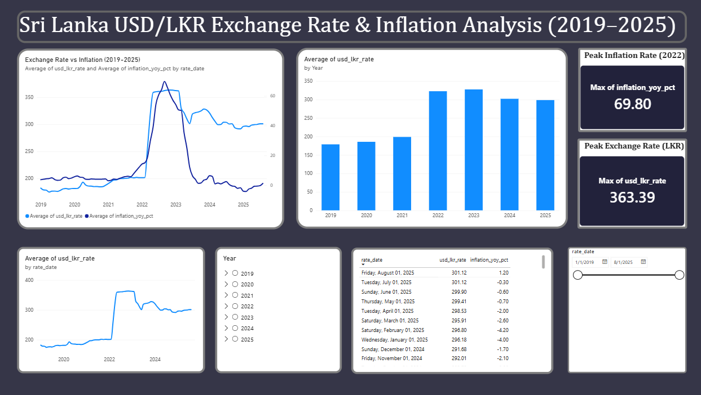

# Sri Lanka USD/LKR Exchange Rate & Inflation Analysis (2019–2025)

## Overview
This project analyzes the relationship between Sri Lanka's USD/LKR exchange rate 
and consumer price inflation from 2019 to 2025, using data from the Central Bank 
of Sri Lanka. The goal was to quantify and visualize the 2022 economic crisis and 
understand how currency depreciation and inflation moved together over time.

## Key Question
How did Sri Lanka's currency crisis in 2022 unfold month-by-month, and how did 
consumer inflation respond?

## Process
1. **Data collection** — Sourced monthly exchange rate and CCPI (Colombo Consumer 
   Price Index) inflation data from the CBSL Data Library
2. **Data cleaning** — Reshaped wide-format government data into clean, analysis-ready 
   long format using Python (pandas)
3. **Database** — Loaded data into a PostgreSQL database (hosted on Neon)
4. **Analysis** — Wrote SQL queries using window functions (LAG) to calculate 
   month-over-month % change and identify the exact crisis turning point
5. **Visualization** — Built an interactive Power BI dashboard

## Dashboard


## Key Finding
The Sri Lankan rupee depreciated sharply starting **March 2022** (+26.8% month-over-month, 
the single largest monthly jump in the dataset), continuing through April (+24.9%) and 
May (+12.4%) as the currency was floated amid the economic crisis. Inflation followed 
with a lag, peaking at **69.8% year-on-year in September 2022** — roughly 4-6 months 
after the sharpest currency movements, showing a delayed pass-through effect from 
currency depreciation to consumer prices.

By 2025, the exchange rate stabilized around 295–301 LKR/USD, roughly 65% higher 
than pre-crisis levels — indicating a new equilibrium rather than a full recovery.

## Tools Used
- **PostgreSQL** (Neon) — data storage and SQL analysis
- **Python (pandas)** — data cleaning and reshaping
- **Power BI** — interactive dashboard and visualization
- **Data Source:** Central Bank of Sri Lanka (CBSL) Data Library

## Repository Structure
```
├── data/       # Cleaned CSV datasets
├── sql/        # Database setup and analytical queries
└── dashboard/  # Power BI file (.pbix) and dashboard screenshot
```
